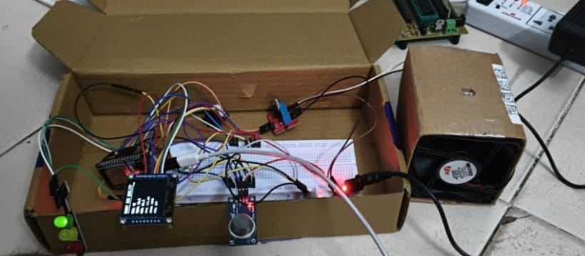
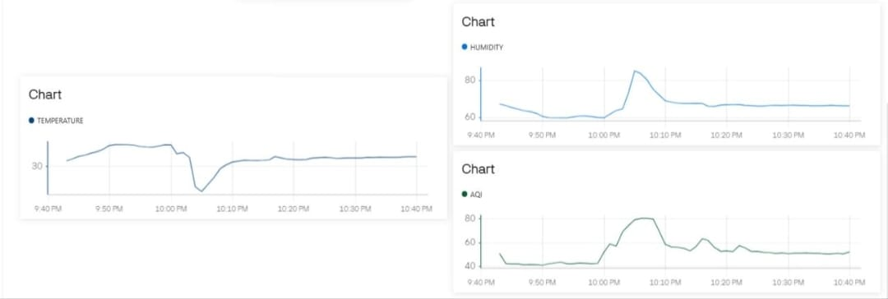

# Smart Air Quality Monitoring System

## Overview
This project is an IoT-based Smart Air Quality Monitoring System developed using the ESP32 microcontroller. It monitors environmental air quality in real time using the MQ-135 gas sensor and DHT22 temperature and humidity sensor. The system calculates the Air Quality Index (AQI), displays live data on an OLED display, uploads readings to the Blynk IoT cloud dashboard, and automatically controls alerts based on air quality.

---

## Features

- Real-time Air Quality Monitoring
- ESP32 Wi-Fi Connectivity
- Blynk IoT Dashboard
- OLED Live Display
- MQ-135 Gas Sensor
- DHT22 Temperature & Humidity Sensor
- AQI Calculation
- LED Air Quality Indication
- Buzzer Alert
- Automatic Ventilation Control

---

## Hardware Components

- ESP32 Development Board
- MQ-135 Gas Sensor
- DHT22 Sensor
- OLED Display
- LEDs
- Buzzer
- Breadboard
- Jumper Wires

---

## Software Used

- Arduino IDE
- ESP32 Board Package
- Blynk IoT Platform
- Embedded C
- U8g2 Graphics Library

---

## Hardware Setup

---

## Blynk IoT Dashboard

---

## Repository Contents

- SMART_AIR_QUALITY_MONITORING_SYSTEM.ino
- README.md
- HARDWARE_SETUP.jpeg
- BLYNK.jpeg

---

## Author

**Mellacheruvu Sadasiva Surya Srinivas**

Electrical and Electronics Engineering

Amrita Vishwa Vidyapeetham, Coimbatore
